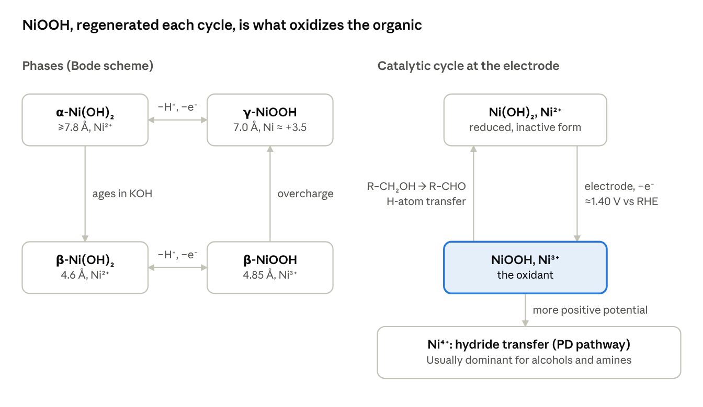

# Ni(OH)₂ / NiOOH for Electrochemical Oxidation of Organics — Literature Review & Protocols

As of Oct 8, 2026.

## Short answer

No, the literature does not show that hourglass Ni(OH)₂ is the best shape for oxidizing organics. Hourglass-like β-Ni(OH)₂ appears in three papers from one group (Nai, Guo et al., 2012–2014). They tested it only for L-histidine sensing on glassy carbon and never compared it with sheets, plates or flowers ([Nai 2013](https://doi.org/10.1002/chem.201203009)).

Your second point is right: every shape is converted in situ to NiOOH above about 1.35–1.40 V vs RHE, and NiOOH does the oxidation. Shape matters only through the features below, which have real support:

1. **Phase:** α or disordered Ni(OH)₂ beats β (urea, glucose), even after normalizing by active area.
2. **Thickness and edges:** ultrathin, edge-rich sheets beat thick plates. Edge Ni sites are more active than basal (001) planes.
3. **Iron:** Fe from ordinary KOH poisons or redirects organic oxidation, so purify your electrolyte.
4. **Wiring:** activity tracks how many Ni sites switch to NiOOH, so thin films in good contact with the electrode win.

**Recommendation.** Start with α-Ni(OH)₂ electrodeposited directly on glassy carbon, or ultrathin α-Ni(OH)₂ nanosheets as an ink. Activate to NiOOH by cycling in Fe-free 1 M KOH, then oxidize your organic at about 1.45–1.50 V vs RHE. Make hourglass β-Ni(OH)₂ only as a comparison sample; a fair, area-normalized test of it would itself be a new result.

## How Ni(OH)₂ oxidizes organics

Ni(OH)₂ is only the precursor: NiOOH, formed on the first anodic sweep, is the species that oxidizes the organic. In Fe-free 1 M KOH the Ni²⁺/Ni³⁺ wave sits near 1.35–1.40 V vs RHE ([Klaus 2015](https://doi.org/10.1021/acs.jpcc.5b00105)). Oxygen evolution on Fe-free NiOOH needs more than 400 mV overpotential, so roughly ≥1.63 V vs RHE ([Trotochaud 2014](https://doi.org/10.1021/ja502379c)). Your working window for organic oxidation lies between those two potentials.



Left: the four phases and how they interconvert. Right: NiOOH oxidizes the organic chemically and is re-oxidized at the electrode; at more positive potentials a hydride-transfer path on Ni⁴⁺ takes over.

**The four phases (Bode scheme).** α-Ni(OH)₂ oxidizes to γ-NiOOH and β-Ni(OH)₂ to β-NiOOH. α ages into β in strong alkali, and overcharging β-NiOOH gives γ-NiOOH ([Bode 1966](<https://doi.org/10.1016/0013-4686(66)80045-2>); [Hall 2015 review](https://doi.org/10.1098/rspa.2014.0792)).

| Phase | Interlayer spacing (Å) | Ni oxidation state | What to know |
| --- | --- | --- | --- |
| α-Ni(OH)₂ | ≥7.8 | +2 | Water and anions between layers; open, hydrated, ages to β in KOH |
| β-Ni(OH)₂ | ≈4.6 | +2 | Brucite structure; compact, stable, the usual hydrothermal product |
| β-NiOOH | ≈4.85 | ≈+3 | Oxidized form of β |
| γ-NiOOH | ≈7.0 | ≈+3.5 to +3.7 | Oxidized form of α, or of overcharged β |

**Pathway 1: indirect (hydrogen-atom transfer).** NiOOH chemically abstracts an H atom from the α-carbon, which is rate-limiting. The organic is oxidized and Ni(OH)₂ is regenerated, then re-oxidized at the electrode ([Fleischmann, Korinek, Pletcher 1971](<https://doi.org/10.1016/S0022-0728(71)80040-2>); [1972](https://doi.org/10.1039/P29720001396)). This current rides on the Ni²⁺/Ni³⁺ wave.

**Pathway 2: potential-dependent (hydride transfer to Ni⁴⁺).** At more positive potentials a second, usually dominant pathway opens ([Bender 2020](https://doi.org/10.1021/jacs.0c10924)). Alcohols and amines go mainly this way; the aldehyde intermediates of HMF oxidation (DFF, FFCA) go mainly by the indirect route ([Bender & Choi 2022](https://doi.org/10.1002/cssc.202200675)). Which path wins depends on whether the substrate outcompetes OH⁻ for adsorption on Ni⁴⁺ sites (Bender 2021, *ACS Catal.* 11, 15110).

**A dissenting view.** Chemically prepared β-NiOOH gives >95% aldehyde/ketone selectivity through two consecutive H-atom transfers. The β→γ change alters selectivity, not reactivity ([Laan 2023](https://doi.org/10.1021/acscatal.3c01120)).

**What this means for shape.** Activity scales with how many Ni sites are electrochemically switched to NiOOH and how fast they are re-oxidized. Thin, open, hydrated (α/γ) and well-wired structures therefore beat thick, dense particles. As a benchmark, thick NiOOH films at 1.47 V vs RHE in 0.1 M KOH gave 96% FDCA yield and 96% Faradaic efficiency from 5 mM HMF ([Taitt 2019](https://doi.org/10.1021/acscatal.8b04003)).

## Shapes and phases compared

The best-supported structure is thin, edge-rich, α or disordered Ni(OH)₂; no study ranks hourglass particles against other shapes. Rows run from the hourglass work, through phase and thickness, to dopants.

| Structure tested | Phase | Reaction | Reported result | Source |
| --- | --- | --- | --- | --- |
| Hourglass-like particles: hexagonal vs truncated-trigonal vs trigonal | β | L-histidine oxidation (sensing, 0.1 M NaOH) | Hexagonal hourglass most active, credited to stacking faults and surface area; detection limit 80 nM; no non-hourglass comparison | [Nai 2013](https://doi.org/10.1002/chem.201203009); [Chen 2014](https://www.osti.gov/etdeweb/biblio/22238437) |
| Hourglass-like particles, growth unit study | β | None (crystal growth) | Hourglass forms by two-stage oriented attachment of Ni(OH)₆⁴⁻ octahedra | [Nai 2012](https://doi.org/10.1021/cg300239c) |
| α vs β powders | α, β | Urea | α gives 138% more current at 1.5 V vs RHE; Tafel 89 vs 121 mV/dec; still wins per active area | [Wu & Hou 2021](https://doi.org/10.1039/D1CY00435B) |
| Disordered α vs β | α, β | Urea | α has the earlier onset; onset coincides with the Ni²⁺/Ni³⁺ wave in both | [Chakrabarty 2021](https://cris.iucc.ac.il/en/publications/urea-oxidation-electrocatalysis-on-nickel-hydroxide-the-role-of-d-2/) |
| Flowers (α) vs nanocone microspheres (β) | α, β | Glucose | α flowers more active; phase and surface area confounded | [Tong 2012](https://pubs.rsc.org/en/content/articlelanding/2012/ce/c2ce25622c) |
| Ultrathin edge-rich nanoflakes vs nanosheets | β | Urea | 142.4 mA/cm² at 0.6 V vs Ag/AgCl, 5.7× the nanosheets; edges form NiOOH more easily | [Appl. Catal. B 2019](https://www.sciencedirect.com/science/article/abs/pii/S0926337319307660) |
| Nanosheets vs nanoflowers vs nanocubes | β | Urea | Nanosheets best (Tafel 72.6 mV/dec) | [Toufani 2023](https://doaj.org/article/591498b66d6e430e9f63d14d9d3428a5) |
| c-oriented nanosheet film vs random particles | — | Urea | Oriented film: lower overpotential, higher current | [Dong 2023](https://doi.org/10.1039/D3RA05538H) |
| Nanoribbons with 4-coordinated edge Ni | — | Methanol | Onset 0.55 V vs RHE, versus about 1.35 V for ordinary Ni(OH)₂ | [Wang 2020](https://doi.org/10.1038/s41467-020-18459-9) |
| Chemically made β-NiOOH vs γ-NiOOH | β, γ | Benzyl and other alcohols | β: >95% aldehyde/ketone selectivity; γ lowers selectivity, not rate | [Laan 2023](https://doi.org/10.1021/acscatal.3c01120) |
| Electrodeposited thick NiOOH film | — | HMF to FDCA | 96% yield, 96% FE at 1.47 V vs RHE, 0.1 M KOH | [Taitt 2019](https://doi.org/10.1021/acscatal.8b04003) |
| Fe-free NiOOH on plasma-treated Ni foam | — | HMF, benzyl alcohol | Up to 800 mA/cm², >95% FE | [Hausmann 2022](https://doi.org/10.1002/aenm.202202098) |
| Co-doped Co₀.₁Ni₀.₉(OH)₂ | β | HMF to FDCA | Onset 1.34 V vs RHE; 96.4% FDCA | [J. Catal. 2023](https://www.sciencedirect.com/science/article/abs/pii/S0021951723001574) |

Iron is the main hidden variable. Fe from unpurified KOH poisons methanol oxidation independently of OER ([Faour 2026](https://pubs.acs.org/aeclc7/article/2/4/939/5148384)) and pushes glycerol oxidation toward C–C cleavage ([Santana 2024](https://doi.org/10.1002/celc.202300570)). Most shape comparisons also confound shape with surface area, and I found no α-vs-β comparison for HMF.

## Synthesis recipes

Temperature sets the phase: urea hydrolysis at 70–90 °C always gives α, while about 150 °C ripens it to β ([Soler-Illia 1999](https://doi.org/10.1021/cm9902220)). Use 99.999% Ni salts if you care about Fe. Fill autoclave liners to no more than about 80%.

**Recipe A — α-Ni(OH)₂ ultrathin-sheet microspheres (solvothermal; recommended first)** ([Yu 2019](https://doi.org/10.3389/fmats.2019.00124))

1. Dissolve 0.2377 g NiCl₂·6H₂O (1.0 mmol) in 30 mL ethanol plus 10 mL ethylene glycol.
2. Stir 30 min at room temperature.
3. Seal in a Teflon-lined autoclave and heat at 170 °C for 24 h.
4. Centrifuge, wash several times with water and ethanol, and vacuum-dry at 60 °C.
5. Expect α-phase (JCPDS 38-0715) sheets with about 170 m²/g surface area.

**Recipe B — α-Ni(OH)₂ flower-like microspheres (urea homogeneous precipitation)** ([Mater. Res. Bull. 2014](https://www.sciencedirect.com/science/article/pii/S0025540814005339))

1. Dissolve 0.294 g Ni(NO₃)₂·6H₂O (1.0 mmol) and 0.120 g urea (2.0 mmol) in 100 mL tert-butanol/water, 9:1 by volume.
2. Hold at 100 °C for 12 h.
3. Wash with water and ethanol, then dry at 60 °C.
4. For an α-vs-β pair from one route, run the same urea bath at a higher temperature to get β ([Tong 2012](https://pubs.rsc.org/en/content/articlelanding/2012/ce/c2ce25622c)).

**Recipe C — β-Ni(OH)₂ hexagonal plates, plus a shape series (hydrothermal)** ([Toufani 2023](https://doi.org/10.1016/j.rechem.2023.101031))

1. Dissolve 0.079 g NaOH in 10 mL water.
2. Add it slowly to 10 mL of 0.1 M NiSO₄·6H₂O under vigorous stirring; stir 30 min.
3. Heat in a 100 mL Teflon-lined autoclave at 180 °C for 8 h; cool naturally.
4. Wash with water and ethanol; dry at 80 °C for 12 h.
5. Expect hexagonal sheets about 190 nm across. The same recipe at 180 °C for 4 h gives about 58 nm cubes; at 100 °C for 2 h it gives nanoflowers.
6. Alternative: precipitate NiCl₂ with NaOH, wash out Na⁺/Cl⁻, then age at 140 or 180 °C for 10 h for 141 or 259 nm plates ([Du 2021](https://doi.org/10.3390/cryst11111407)).

**Recipe D — room-temperature precipitation.** Ammonia precipitation from nitrate near 4 °C gives α; at 25–65 °C it gives β, fault-free at 65 °C ([Ramesh & Kamath 2008](https://doi.org/10.1007/s12034-008-0029-x)). Aging α in hot alkali converts it to β.

**Hourglass β-Ni(OH)₂.** It is made by a "facile solution route" with growth along the β c-axis by oriented attachment ([Nai 2012](https://doi.org/10.1021/cg300239c); Chen 2014, *Electrochim. Acta* 116, 258). The exact amounts are only in the paywalled experimental sections, which I could not open. Request those two papers through your library before attempting it.

**Check what you made.**

| Phase | XRD (Cu Kα) | Raman |
| --- | --- | --- |
| α-Ni(OH)₂ | (003) at about 11–12° 2θ (d ≈ 7.5–8 Å); (006) about 22–23° | About 460 cm⁻¹; broad O–H band |
| β-Ni(OH)₂ | (001) at about 19.3°; (100) 33.1°, (101) 38.5°, (110) 59.0° (JCPDS 14-0117) | Sharp O–H stretch near 3580 cm⁻¹ |
| β-NiOOH (after activation) | — | 480 and 560 cm⁻¹ |

FTIR of α also shows a broad 3400 cm⁻¹ water band and intercalated nitrate or carbonate near 1380 cm⁻¹.

## Depositing on glassy carbon

Electrodeposit α-Ni(OH)₂ directly on the GC for clean kinetics; drop-cast an ink when you need to test a specific shape such as plates or hourglasses. Direct OH⁻-generation deposits give disordered α that is about 10× more active for methanol than β made by cycling Ni metal ([E 2016](https://doi.org/10.1021/acs.jpcc.5b12741)).

**Step 0 — polish the GC (every time).**

1. Polish with 1.0, then 0.3, then 0.05 µm alumina on separate microcloth pads, in figure-8 strokes ([Pine guide](https://pineresearch.com)).
2. Rinse with water, then sonicate 1–5 min in water and in 50:50 ethanol/water, keeping only the tip immersed.
3. Check in ferricyanide: a peak separation of roughly 60–70 mV means a clean surface.

**Route 1 — cathodic electrodeposition from nitrate (recommended).** Reducing NO₃⁻ at the electrode makes OH⁻, the local pH rises, and Ni(OH)₂ precipitates on the surface ([Streinz 1995](https://doi.org/10.1149/1.2044134)).

1. Bath: 10 mM Ni(NO₃)₂·6H₂O + 30 mM KNO₃ in water, N₂-sparged ([Goetz, Bender, Choi 2022](https://doi.org/10.1038/s41467-022-33637-7)).
2. Three-electrode cell: GC working, Pt counter, Ag/AgCl reference.
3. Thin film: −0.25 mA/cm² for 45 s. Thick film: −0.37 mA/cm² for 3 min. On a 3 mm GC (0.0707 cm²), −0.25 mA/cm² is −17.7 µA; on a 5 mm GC (0.196 cm²) it is −49 µA.
4. Rinse gently with water. The product is amorphous α-Ni(OH)₂; the thin films held 24.6 nmol Ni per 0.5 cm², all of it electroactive.
5. Alternative: 0.01 M Ni(NO₃)₂ at −1 mA/cm² for 75 s gives about 30 nm ([Klaus 2015](https://doi.org/10.1021/acs.jpcc.5b00105)).
6. Deposition efficiency is below 100%, so measure loading from the Ni redox charge, not from the charge passed.

**Route 2 — catalyst ink (for powders of a chosen shape).**

| Recipe | Solids | Solvent | Nafion (5 wt%) | Drop | Loading |
| --- | --- | --- | --- | --- | --- |
| [Toufani 2023](https://doi.org/10.1016/j.rechem.2023.101031), urea oxidation | 16.0 mg Ni(OH)₂ + 4.0 mg Vulcan XC-72 | 750 µL water + 250 µL ethanol | 100 µL | 3 µL on 3 mm GC | 0.676 mg/cm² |
| [Jung 2016](https://doi.org/10.1039/C5TA07586F), OER benchmark | 80 mg oxide | 3.8 mL water + 1.0 mL isopropanol | 40 µL | 10 µL on 5 mm GC, dried 10 min at 60 °C | 0.8 mg/cm² |
| Suggested start (scaled from the above) | 5 mg Ni(OH)₂ (+1 mg Vulcan, optional) | 750 µL water + 250 µL isopropanol | 20 µL | 5 µL on 3 mm GC | ≈ 0.35 mg/cm² |

Sonicate the ink 30–60 min before use (Toufani sonicated 6 h before adding Nafion, then 15 min more). Dry the drop while rotating the electrode at about 700 rpm: a static drop dries as a coffee ring, 0.04 µm thick in the centre and 4.5 µm at the edge ([Garsany 2011](https://doi.org/10.1016/j.jelechem.2011.09.016)). Nafion keeps the film on: without it, activity fell about 50% after a stability test, versus under 5% with it ([Kakati 2023](https://doi.org/10.1021/acsami.3c08377)).

**Avoid** depositing Ni metal and then cycling it in NaOH (Raoof 2013, *S. Afr. J. Chem.* 66, 47). It works, but it yields β-Ni(OH)₂, the less active phase.

## Activation to NiOOH and testing

You do not need a separate oxidation step: cycling in Fe-free KOH turns the Ni(OH)₂ into NiOOH, and the Ni redox charge tells you how much Ni is active.

**1. Make Fe-free KOH** ([Trotochaud 2014](https://doi.org/10.1021/ja502379c), as reproduced by later groups). Use polypropylene or PTFE, cleaned in H₂SO₄; never glass.

1. Dissolve about 2 g Ni(NO₃)₂·6H₂O (99.999%) in 4 mL water.
2. Add 20 mL 1 M KOH quickly, shake, centrifuge and decant.
3. Wash the Ni(OH)₂ pellet 2–3 times with water and once with 1 M KOH.
4. Disperse it in about 50 mL of the KOH to be purified; shake, then let it stand at least 3 h.
5. Centrifuge and keep the supernatant. Expect some dissolved Ni to remain.

Fe-free KOH matters for organics, not just OER: methanol oxidation kept 99% of its rate over 24 h in Fe-free KOH ([Faour 2026](https://pubs.acs.org/aeclc7/article/2/4/939/5148384)).

**2. Activate.** Cycle in 1 M KOH (or 0.1 M for HMF) between about 0.93 and 1.53 V vs RHE (0 to 0.6 V vs Hg/HgO) at 50–100 mV/s. Stop when the Ni²⁺/Ni³⁺ peaks near 1.35–1.40 V stop changing, typically after 20–50 cycles. This window is common practice rather than taken from one paper.

**3. Count active Ni.** Integrate the cathodic Ni³⁺→Ni²⁺ peak (it avoids OER overlap). Then:

```latex
n_{\mathrm{Ni}} = \frac{Q}{n\,F}
```

Take n ≈ 1 electron per Ni for β/β and about 1.5–1.7 for α/γ ([Wu & Hou 2021](https://doi.org/10.1039/D1CY00435B)). Poorly wired films undercount, so compare samples at similar loading.

**4. Test the organic.** Run LSV at 5 mV/s with and without substrate, then hold at 1.45–1.50 V vs RHE and quantify products by HPLC or NMR to get Faradaic efficiency. Literature conditions to copy:

| Substrate | Electrolyte | Concentration | Source |
| --- | --- | --- | --- |
| HMF | 0.1 M KOH (pH 13) | 5 mM | [Taitt 2019](https://doi.org/10.1021/acscatal.8b04003) |
| Ethanol | 1 M KOH | 50 mM | [Chen 2020](https://doi.org/10.1016/j.chempr.2020.07.022) |
| Urea | 1 M KOH | 0.33 M | [Toufani 2023](https://doi.org/10.1016/j.rechem.2023.101031) |

**5. Controls and reporting.**

- [ ] Bare GC, and GC + Nafion/Vulcan without Ni, in the same electrolyte with substrate
- [ ] Calibrate the reference against RHE (Pt in H₂-saturated electrolyte); report iR correction
- [ ] Report loading by mass and by Ni redox charge, and current per geometric area and per active Ni
- [ ] Report electrolyte Fe treatment, and for HMF use fresh solutions, since HMF degrades in strong base
- [ ] Keep GC stability tests short: above roughly 0.2 V vs RHE the carbon itself oxidizes and bubbles detach films ([Bornet 2024](https://doi.org/10.1021/acscatal.4c05447))

## Sources

Start with three reviews: [Ghosh 2024](https://doi.org/10.1002/aenm.202400696) on Ni in organic oxidation, [Chen 2020](https://doi.org/10.1016/j.chempr.2020.07.022) on design principles, and [Hall 2015](https://doi.org/10.1098/rspa.2014.0792) on Ni(OH)₂ structures and synthesis.

How these were checked: this research environment's network blocked full-text pages, so facts come from publisher abstracts and search extracts of the full text and SI. Check every quantity against the PDF before running a recipe. The activation window, the ferricyanide check and the minor XRD peaks are common practice, not taken from one cited paper.

- Bender, Lam, Hammes-Schiffer, Choi (2020). [Unraveling two pathways for electrochemical alcohol and aldehyde oxidation on NiOOH](https://doi.org/10.1021/jacs.0c10924). *JACS* 142, 21538.
- Bender, Choi (2022). [Electrochemical oxidation of HMF via hydrogen atom transfer and hydride transfer on NiOOH](https://doi.org/10.1002/cssc.202200675). *ChemSusChem*.
- Bender, Warburton, Hammes-Schiffer, Choi (2021). *ACS Catal.* 11, 15110.
- Bode, Dehmelt, Witte (1966). [Zur Kenntnis der Nickelhydroxidelektrode I](<https://doi.org/10.1016/0013-4686(66)80045-2>). *Electrochim. Acta* 11, 1079.
- Bornet et al. (2024). [GC substrate effects in alkaline stability tests](https://doi.org/10.1021/acscatal.4c05447). *ACS Catal.*
- Chakrabarty et al. (2021). [Urea oxidation electrocatalysis on nickel hydroxide: the role of disorder](https://cris.iucc.ac.il/en/publications/urea-oxidation-electrocatalysis-on-nickel-hydroxide-the-role-of-d-2/). *J. Solid State Electrochem.* 25, 159.
- Chen et al. (2020). [Activity origins and design principles of nickel-based catalysts for nucleophile electrooxidation](https://doi.org/10.1016/j.chempr.2020.07.022). *Chem* 6, 2974.
- Chen, Nai, Ma, Li (2014). [Nickel hydroxide nanocrystals-modified glassy carbon electrodes for L-histidine detection](https://www.osti.gov/etdeweb/biblio/22238437). *Electrochim. Acta* 116, 258.
- Dong et al. (2023). [Self-assembled c-oriented Ni(OH)₂ films for urea oxidation](https://doi.org/10.1039/D3RA05538H). *RSC Adv.*
- Du et al. (2021). [Hydrothermal β-Ni(OH)₂ plates](https://doi.org/10.3390/cryst11111407). *Crystals* 11, 1407.
- E et al. (2016). [Electrodeposited α vs β Ni(OH)₂ for methanol oxidation](https://doi.org/10.1021/acs.jpcc.5b12741). *J. Phys. Chem. C* 120, 16059.
- Faour et al. (2026). [Fe in the alkaline electrolyte causes poisoning of the methanol oxidation reaction at Ni-oxyhydroxide](https://pubs.acs.org/aeclc7/article/2/4/939/5148384). *ACS Electrochem.* 2, 939.
- Fleischmann, Korinek, Pletcher (1971). [The oxidation of organic compounds at a nickel anode in alkaline solution](<https://doi.org/10.1016/S0022-0728(71)80040-2>). *J. Electroanal. Chem.* 31, 39.
- Fleischmann, Korinek, Pletcher (1972). [Kinetics and mechanism of the oxidation of amines and alcohols at oxide-covered electrodes](https://doi.org/10.1039/P29720001396). *J. Chem. Soc., Perkin Trans. 2*, 1396.
- Garsany et al. (2011). [Rotational drying of RDE catalyst films](https://doi.org/10.1016/j.jelechem.2011.09.016). *J. Electroanal. Chem.* 662, 396.
- Ghosh et al. (2024). [Deciphering the role of nickel in electrochemical organic oxidation reactions](https://doi.org/10.1002/aenm.202400696). *Adv. Energy Mater.* 14.
- Goetz, Bender, Choi (2022). [NiOOH electrodes for glycerol oxidation](https://doi.org/10.1038/s41467-022-33637-7). *Nat. Commun.*
- Hall, Lockwood, Bock, MacDougall (2015). [Nickel hydroxides and related materials: a review](https://doi.org/10.1098/rspa.2014.0792). *Proc. R. Soc. A* 471, 20140792.
- Hausmann et al. (2022). [Fe-free NiOOH on plasma-treated Ni foam for organic oxidation](https://doi.org/10.1002/aenm.202202098). *Adv. Energy Mater.*
- Jung, McCrory, Ferrer, Peters, Jaramillo (2016). [Benchmarking OER catalysts](https://doi.org/10.1039/C5TA07586F). *J. Mater. Chem. A* 4, 3068.
- Kakati et al. (2023). [Nafion binder and film stability](https://doi.org/10.1021/acsami.3c08377). *ACS Appl. Mater. Interfaces*.
- Klaus, Cai, Louie, Trotochaud, Bell (2015). [Phase and Fe effects in Ni(OH)₂/NiOOH films](https://doi.org/10.1021/acs.jpcc.5b00105). *J. Phys. Chem. C* 119, 7243.
- Laan et al. (2023). [Understanding the oxidative properties of nickel oxyhydroxide in alcohol oxidation reactions](https://doi.org/10.1021/acscatal.3c01120). *ACS Catal.* 13, 8467.
- Mater. Res. Bull. (2014). [Flower-like α-Ni(OH)₂ hollow microspheres by urea precipitation](https://www.sciencedirect.com/science/article/pii/S0025540814005339).
- Nai, Wu, Guo, Yang (2012). [Coordination polyhedra as a growth unit (hourglass β-Ni(OH)₂)](https://doi.org/10.1021/cg300239c). *Cryst. Growth Des.* 12, 2653.
- Nai et al. (2013). [Structure-dependent electrocatalysis of Ni(OH)₂ hourglass-like nanostructures towards L-histidine](https://doi.org/10.1002/chem.201203009). *Chem. Eur. J.* 19, 501.
- Pine Research. [Glassy carbon electrode polishing guide](https://pineresearch.com).
- Ramesh, Kamath (2008). [Synthesis of nickel hydroxide phases](https://doi.org/10.1007/s12034-008-0029-x). *Bull. Mater. Sci.* 31, 169.
- Raoof, Ojani, Hosseini (2013). *S. Afr. J. Chem.* 66, 47.
- Santana, Gjonaj, Garcia (2024). [Fe impurities and glycerol oxidation on Ni](https://doi.org/10.1002/celc.202300570). *ChemElectroChem* 11, e202300570.
- Soler-Illia et al. (1999). [Urea homogeneous precipitation of nickel hydroxide](https://doi.org/10.1021/cm9902220). *Chem. Mater.* 11, 3140.
- Streinz, Hartman, Motupally, Weidner (1995). [Current and nickel nitrate concentration in Ni(OH)₂ deposition](https://doi.org/10.1149/1.2044134). *J. Electrochem. Soc.* 142, 1084.
- Taitt, Nam, Choi (2019). [Ni, Co and Fe oxyhydroxide anodes for HMF oxidation to FDCA](https://doi.org/10.1021/acscatal.8b04003). *ACS Catal.* 9, 660.
- Tong et al. (2012). [Polymorphous α- and β-Ni(OH)₂ complex architectures](https://pubs.rsc.org/en/content/articlelanding/2012/ce/c2ce25622c). *CrystEngComm* 14, 5963.
- Toufani, Besic, Tong, Farràs (2023). [β-Ni(OH)₂ morphologies for urea oxidation](https://doi.org/10.1016/j.rechem.2023.101031). *Results Chem.* 6, 101031.
- Trotochaud, Young, Ranney, Boettcher (2014). [Nickel–iron oxyhydroxide OER electrocatalysts: the role of intentional and incidental iron](https://doi.org/10.1021/ja502379c). *JACS* 136, 6744.
- Ultrathin β-Ni(OH)₂ nanoflakes with abundant edge sites (2019). [*Appl. Catal. B* 259](https://www.sciencedirect.com/science/article/abs/pii/S0926337319307660).
- Co-doped β-Ni(OH)₂ for HMF oxidation (2023). [*J. Catal.*](https://www.sciencedirect.com/science/article/abs/pii/S0021951723001574)
- Wang et al. (2020). [Electron delocalization in nickel hydroxide nanoribbons for methanol oxidation](https://doi.org/10.1038/s41467-020-18459-9). *Nat. Commun.* 11, 4647.
- Wu, Hou (2021). [Superior catalytic activity of α-Ni(OH)₂ for urea electrolysis](https://doi.org/10.1039/D1CY00435B). *Catal. Sci. Technol.* 11, 4294.
- Yu et al. (2019). [Ultrathin α-Ni(OH)₂ nanosheets](https://doi.org/10.3389/fmats.2019.00124). *Front. Mater.* 6, 124.
